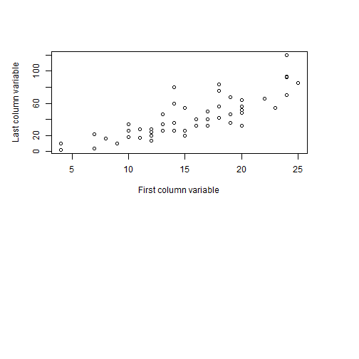

## Why apps matters to statistic findings? 

Often times statistic findings such as plots, summary and tables scatter around on a paper and are difficult for readers to follow. Using apps matters a lot to improve the reader experience  with the follow reasons:

1.It can put plots, summary and tables in one place for a easier reference experience.

2. It can display statistic findings in a more interactive way.

3. Interacting makes the statistic findings easy to understand and remember. 

--- .class #id 

## What this app can do? 

This is a simple app that displays plots, summary and tables of two datasets. It has the following features:

1. This app provides the summary metric including mean, min, max and quantile info for the two data set after readers select

2. This app put the plots, summary and tables in one place so that readers can refer easily to each other

3. Readers are given freedom to select a subset to see the dataset by entering any number in the text box while the dataset does have maximum dimensions.

--- .class#id

## What can be done in the future?

In order to make the app more complex, below is some considerations:

1. We can load a larger dataset from a local drive to make the data part more interesting.

2. we can embed more interactive buttons. For example, we can use checkbox to allow outlier.

3. We can also perform some predictions for the data and make it another tab.

--- .class#id

## Some code that the app used


Below code is used to render the plot when the reader selected cars dataset. 

```r
library(ggplot2)
par(mai=c(4,1,1,1))
plot(cars[,2]~cars[,1],xlab="First column variable",ylab="Last column variable")
```

 


